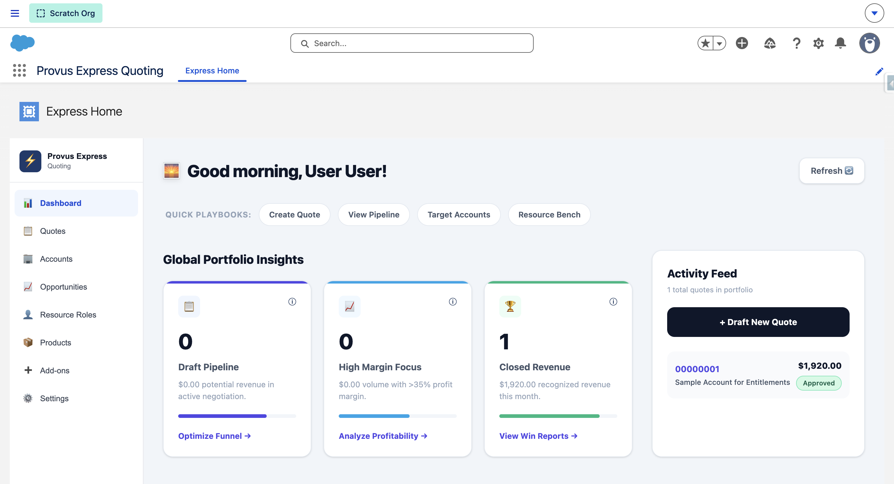
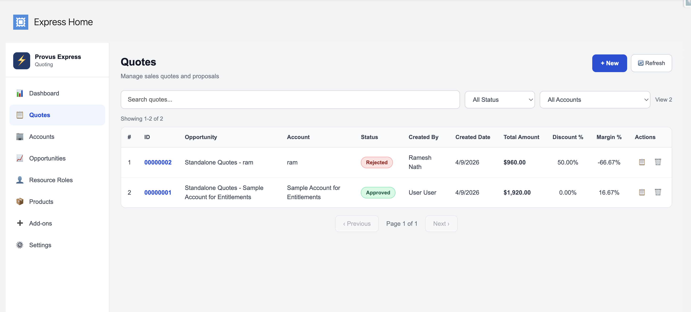
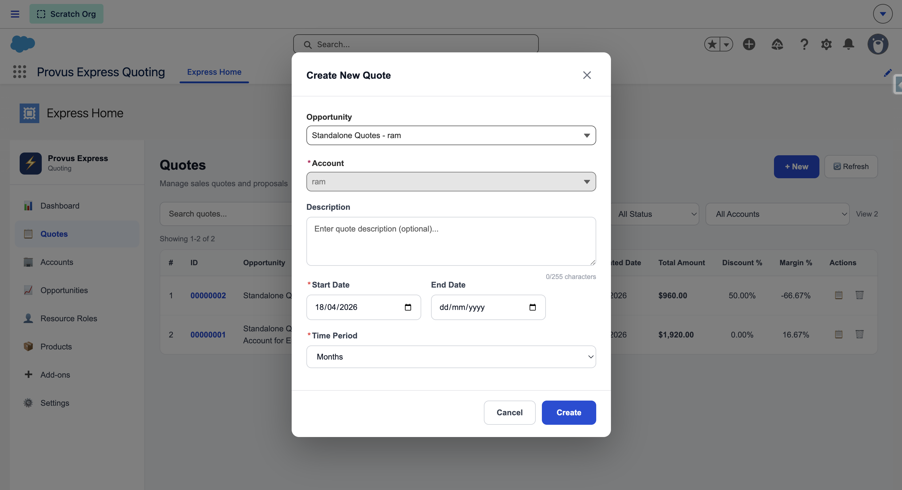
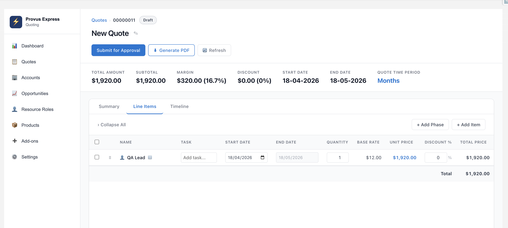
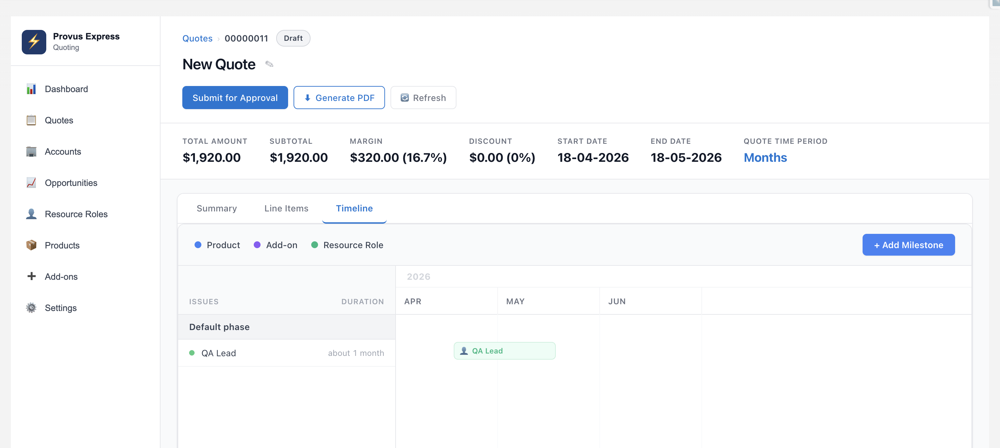
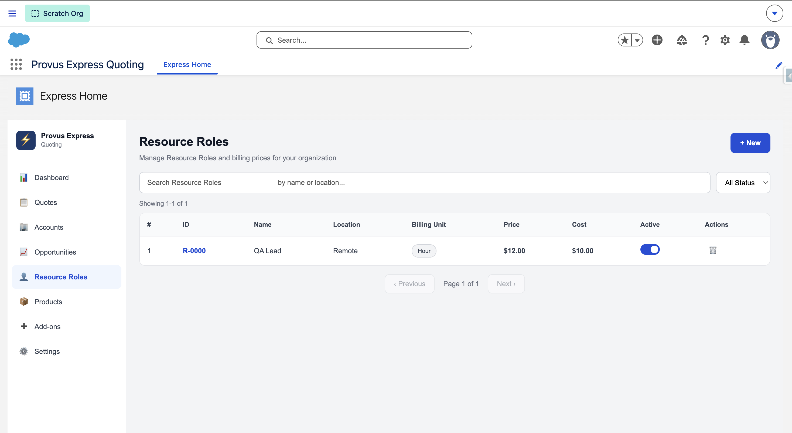
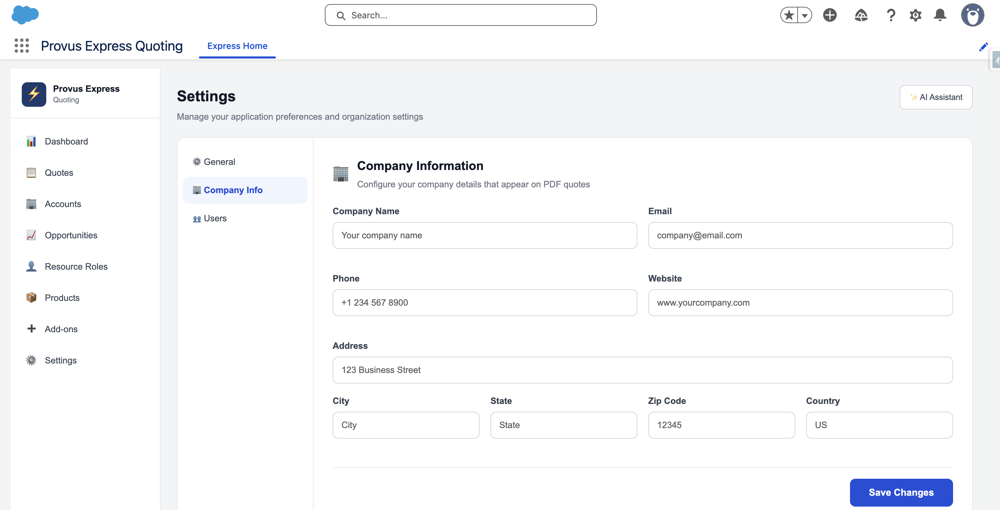
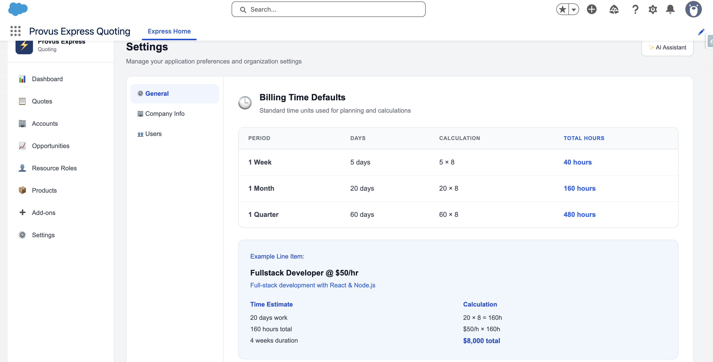
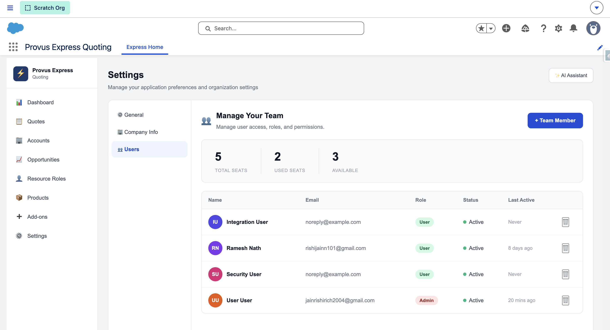

# Provus Express Quoting

Provus Express Quoting is a streamlined, powerful Configure, Price, Quote (CPQ) application purpose-built natively on the Salesforce platform. It is designed to accelerate the sales cycle by enabling sales teams and managers to efficiently configure quotes, price services and products, map out delivery timelines, and generate professional PDF proposals.

## Key Features

### 1. Dashboard & Revenue Tracking
Access high-level insights into your ongoing quotes, pipeline revenue, and cumulative margins from the main dashboard component.



### 2. Comprehensive Quoting Engine
Manage your entire quoting lifecycle from a centralized interface.
- **Quotes List:** Instantly view all drafted, pending, and approved quotes.
- **Create Quote Dialog:** Quickly initiate new opportunities with integrated approval systems.
- **Quote Detail Workspace:** An expansive workspace for adding line items, managing discounts, analyzing margin performance, and generating final PDFs.





### 3. Timeline Planner & Phased Delivery
Plot line items along a project timeline using a rich visual Gantt-style interface. This allows users to group scope into distinct phases and visualize the duration realistically before finalizing the quote.



### 4. Resource Roles Management
Define billable roles (e.g., QA Lead, Full-stack Developer) along with custom **Cost** and **Price** rates. Manage regional pricing by location and assign standardized billing units (Hourly, Weekly, Monthly) to maintain precise margin calculations.



### 5. Application & Core Settings
Maintain absolute control over your environment's parameters:
- **Company Information:** Easily manage your organization's essential details (Company Name, Email, Address). This data seamlessly integrates with the quoting engine to dynamically brand your outgoing PDF proposals.
- **Billing Time Defaults:** Define standard work capacities (e.g., 1 Week = 40 hours, 1 Month = 160 hours). 
- **User Management:** Distribute available seats and assign proper permission layers (Admin vs. Standard User).





## Architecture & Technologies

This application is built using modern Salesforce architecture:
- **Lightning Web Components (LWC):** Powers a sleek, Single Page Application (SPA)-like experience. Extensive use of modular components (`provusExpressApp`, `provusQuoteDetail`, `provusQuoteTimeline`, etc.).
- **Apex Code Layer:** Follows a rigorous separation of concerns utilizing Controllers, Services, and Data Access Objects (DAOs) for scalable business logic manipulation.
- **Custom Objects:** Natively integrated data layers utilizing custom structures like `Resource_Role__c`, `Add_On__c`, `Quote_Line_Item__c`, and `Organization_Settings__c`.
- **Security & Perms:** Fully governed by declarative security policies (`CPQ_Manager_Access`, `CPQ_Salesperson_Access`).

## Getting Started

1. **Deploy Metadata:** Use the Salesforce CLI (`sfdx` or `sf`) to deploy the source code to your org:
   ```bash
   sf project deploy start
   ```
2. **Assign Permission Sets:** Assign `CPQ_Manager_Access` to your environment Administrators, and `CPQ_Salesperson_Access` to standard users.
3. **Configure the Core System:** Navigate to the **Express Home** application tab, open up **Settings**, and complete your organizational defaults before constructing your first quote.
